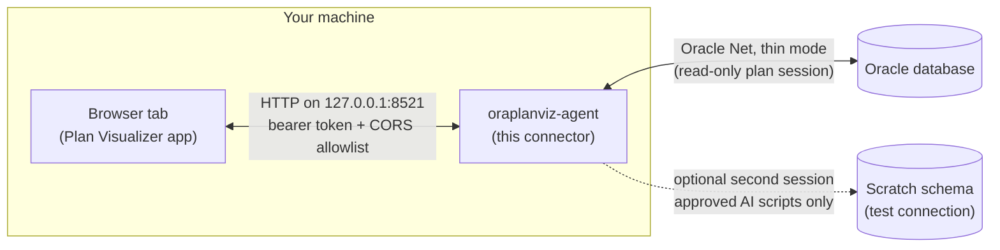
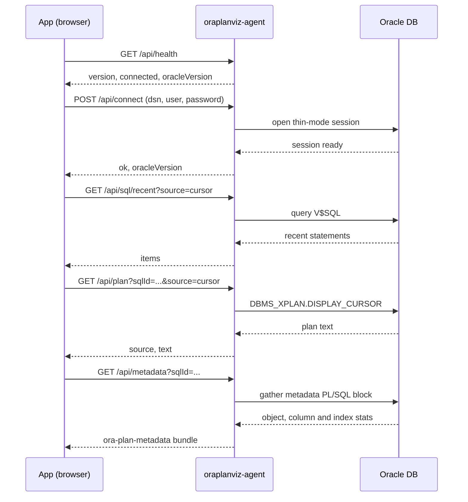

# oraplanviz-db-connector

A minimal local companion (formerly `oraplanviz-agent`; the CLI command is still `oraplanviz-agent`) for the [Oracle Execution Plan
Visualizer](https://davidbudac.github.io). It runs on **your own machine**,
connects to **your** Oracle database using
[python-oracledb](https://python-oracledb.readthedocs.io/) in **thin mode**
(pure Python — no Oracle Instant Client required), and exposes a small
localhost JSON HTTP API that the web app's "Connect to database" panel talks
to directly from your browser.

Your credentials and your execution plan data never leave your machine: the
agent only ever talks to your Oracle database and to your browser on
`127.0.0.1`. No server, not even the app's host, ever sees them.

The Connect panel is only present in dev or self-hosted builds of the app made
with `VITE_ENABLE_DB_AGENT=1` (for example `VITE_ENABLE_DB_AGENT=1 npm run dev`).
It is not part of the public GitHub Pages build.

## Quick start

### How the pieces fit together



Nothing leaves the "Your machine" box except Oracle Net traffic from the
connector to your database.

### Step by step

1. **Run the app with the Connect panel enabled.** The public GitHub Pages
   build does not include it.

   ```bash
   # from a checkout of the app
   VITE_ENABLE_DB_AGENT=1 npm run dev         # -> http://localhost:5173

   # or with Docker
   docker compose --profile agent up --build  # -> http://localhost:8081
   ```

2. **Install the connector** (needs Python 3.9 or newer; no Oracle Instant
   Client).

   ```bash
   pipx install git+https://github.com/davidbudac/oraplanviz-db-connector.git
   ```

3. **Start it.** Add `--allow-origin` if the app is not on
   `http://localhost:5173` (the Docker profile above serves it on port 8081).

   ```bash
   oraplanviz-agent
   # or, for the Docker profile:
   oraplanviz-agent --allow-origin http://localhost:8081
   ```

   It prints a banner. Keep this terminal open and copy the bearer token:

   ```text
   ========================================================================
    oraplanviz-agent v0.2.0
   ========================================================================
    Listening on:      http://127.0.0.1:8521
    Bearer token:      kQ3v0m2Zr8bYx1d9WnT5uLfH7sJcPq4A
    Allowed origins:
      - http://localhost:5173
      - http://127.0.0.1:5173

    Paste the URL and token into the app's Connect panel.
    Security note: this agent binds to localhost only and requires the
    bearer token above for every request except /api/health. Credentials
    you provide are held in memory only and are never written to disk.
    Scripts sent to /api/test/* run on a SEPARATE test connection you
    open yourself; every statement they run is logged to this console.
   ========================================================================
   ```

   The token is random and changes on every restart (unless you pass
   `--token`).

4. **Open DB Connect in the app** (top bar "DB Connect" button, or the command
   palette: "Connect to database..."). **Step 1, Start the connector**, turns
   green on its own once the app can reach the connector.
5. **Step 2, Paste the access token** from the banner. It is verified
   automatically.
6. **Step 3, Connect to your database**: DSN (`host:1521/service_name`), user,
   and password. This step is skipped if you started the connector with
   `--dsn` and `--user`.
7. **Step 4, Pick a statement.** Choose from the **Recent statements** tab
   (cursor cache or SQL Monitor) or the **By SQL ID** tab (source: cursor,
   monitor, or AWR). Leave **Attach DB metadata** checked to also pull table,
   index and column statistics. The plan renders in the app.

An optional, collapsed **Test connection for AI scripts** section opens a
separate scratch-schema session; see
[The test connection](#the-test-connection-apitest).

### What happens when you load a plan



Every request except `/api/health` carries `Authorization: Bearer <token>`.

## Install

Requires Python 3.9 or newer. The only runtime dependency is `oracledb>=2.0`
(thin mode, no native client libraries needed).

```bash
# recommended: isolated tool install straight from GitHub
pipx install git+https://github.com/davidbudac/oraplanviz-db-connector.git

# or, from a checkout of this repo
pip install -e .
```

The connector is not on PyPI yet; once it is published this becomes
`pipx install oraplanviz-agent`.

## Usage

```bash
oraplanviz-agent
```

This starts the agent on `http://127.0.0.1:8521`, prints a random bearer
token, and prints the allowed CORS origins. Follow the
[Quick start](#quick-start) to paste the token into the app and connect.

Useful flags:

```
--port PORT             Port to listen on (default: 8521)
--host HOST             Host to bind to (default: 127.0.0.1 -- do not change
                         this unless you understand the risk)
--allow-origin ORIGIN   Allowed CORS origin (repeatable). Defaults to
                         http://localhost:5173 and http://127.0.0.1:5173.
                         Add your origin if you self-host the app elsewhere.
--token TOKEN           Bearer token clients must supply. A random one is
                         generated if omitted.
--dsn DSN               Oracle DSN to connect to on startup, e.g.
                         host:1521/service_name
--user USER             Oracle username to connect with on startup (you will
                         be prompted for the password; it is never accepted
                         as a command-line argument).
```

Example, connecting on startup and allowing a self-hosted app origin:

```bash
oraplanviz-agent \
  --allow-origin https://planviz.internal.example \
  --allow-origin http://localhost:5173 \
  --dsn dbhost.example.com:1521/pdb1.example.com \
  --user planviz
```

You can also connect after startup from the app's Connect panel (step 3,
**Connect to your database**) — it POSTs `dsn`/`user`/`password` to
`/api/connect`.

## Security model

- **Binds to `127.0.0.1` only** (never `0.0.0.0`) — the agent is not reachable
  from other machines on your network.
- **Bearer token**, randomly generated at startup (or set with `--token`),
  required on every `/api/*` request except `/api/health`. This blocks
  drive-by web pages from hitting your agent even though it listens on
  localhost.
- **CORS allowlist** (`--allow-origin`, repeatable) — only requests whose
  `Origin` header matches an allowed origin get `Access-Control-Allow-Origin`
  back, so browsers block cross-origin reads from other sites.
- **Chrome Private Network Access**: the agent answers `OPTIONS` preflights
  carrying `Access-Control-Request-Private-Network: true` with
  `Access-Control-Allow-Private-Network: true`, which Chrome requires for an
  HTTPS page (e.g. a self-hosted build) to reach `127.0.0.1`.
- **Mixed content**: Chrome and Firefox treat `http://127.0.0.1` as
  "potentially trustworthy", so an `https://` page can fetch it. **Safari
  blocks this** (no localhost exception for mixed content) — Safari users
  should run the app's local dev server (`npm run dev`, `http://localhost`)
  instead of an HTTPS-hosted build.
- **Credentials are held in agent process memory only** — never written to
  disk, never logged. They are lost when the agent process exits or you call
  `/api/disconnect`.
- **Script execution is opt-in and segregated.** The agent only runs SQL you
  send to `/api/test/*`, and only on the separate test connection you opened
  yourself (see [The test connection](#the-test-connection-apitest)). Give that
  connection a scratch schema with the narrowest privileges the scripts need —
  the plan-reading connection stays read-only.

## Troubleshooting

| Symptom | Likely cause | Fix |
|---------|--------------|-----|
| Step 1 stays on "connector not found" | The connector is not running, is on another port, or the app's origin is not allowed. The browser reports a CORS rejection the same way as an unreachable server. | Check the terminal is still running. Compare the banner's `Allowed origins` with the address bar of the app; if they differ, restart with `--allow-origin <origin>` (e.g. `http://localhost:8081` for the Docker profile). If you used `--port`, the app must use the same port. |
| Token rejected (HTTP 401) | Token mistyped, or the connector was restarted (the token is regenerated on every start). | Copy the token again from the current banner, or start with a fixed `--token`. |
| `ORA-01017: invalid username/password` | Wrong user or password. | Retry; check the account is not locked. Passwords are case-sensitive on 11g and later. |
| `ORA-12514`, `ORA-12541`, `DPY-6005` | The DSN is wrong (host, port or service name), or the listener is down. | Use `host:1521/service_name`, not an SID. List the real service names with `lsnrctl status` on the database host. For a PDB use the PDB's own service, not the CDB's. |
| Safari blocks the request from an `https://` page | Safari has no mixed-content exception for `http://127.0.0.1`. | Use Chrome or Firefox, or run the app's local dev server (`npm run dev`, `http://localhost`). |
| "Plan loaded without DB metadata" | The metadata gather could not read the catalog views. The plan itself still loads. | `GRANT SELECT_CATALOG_ROLE TO <user>;` and load again. See [Minimal DB grants](#minimal-db-grants). |
| Recent statements list is empty | The statement aged out of the cursor cache, or nothing has run recently. | Run the statement again, or use the **By SQL ID** tab with the AWR source (Diagnostics Pack). |
| SQL Monitor or AWR source returns an error | Missing pack licence or missing grants. | See [Licensing note](#licensing-note); the `cursor` source is always free. |

## Licensing note

Not every plan source is free to use:

- `source=cursor` (`DBMS_XPLAN.DISPLAY_CURSOR`) — **free**, part of the base
  database.
- `source=monitor` (`DBMS_SQL_MONITOR.REPORT_SQL_MONITOR`) — requires the
  **Oracle Tuning Pack**.
- `source=awr` (`DBMS_XPLAN.DISPLAY_AWR`) — requires the **Oracle Diagnostics
  Pack**.

The app labels the pack-licensed sources in the UI. Default to `cursor`
unless you know you're licensed for the others.

## Minimal DB grants

The simplest working setup is the standard read-only catalog role:

```sql
GRANT SELECT_CATALOG_ROLE TO planviz_agent_user;
```

This covers every endpoint including `/api/metadata` at full coverage. If you
prefer narrower grants, the agent's DB user needs read access to a handful of
dynamic performance views, plus execute on the `DBMS_XPLAN`/`DBMS_SQL_MONITOR`
packages:

```sql
GRANT SELECT ON v$sql TO planviz_agent_user;
GRANT SELECT ON v$sql_monitor TO planviz_agent_user;
GRANT SELECT ON v$sql_plan TO planviz_agent_user;
GRANT SELECT ON v$sql_plan_statistics_all TO planviz_agent_user;
-- DBMS_XPLAN.DISPLAY_CURSOR / DISPLAY_AWR and DBMS_SQL_MONITOR.REPORT_SQL_MONITOR
-- are typically EXECUTE-able by any authenticated user; if not:
GRANT EXECUTE ON DBMS_XPLAN TO planviz_agent_user;
GRANT EXECUTE ON DBMS_SQL_MONITOR TO planviz_agent_user;
```

`source=awr` additionally requires access to `DBA_HIST_*` views (Diagnostics
Pack). `/api/metadata` works with any level of access and reports whatever it
could not read in the bundle's `coverage_warnings`.

## API reference

All responses are JSON. All `/api/*` endpoints except `/api/health` require
an `Authorization: Bearer <token>` header.

| Method | Path                | Description |
|--------|---------------------|--------------|
| GET    | `/api/health`       | `{ version, connected, oracleVersion, testConnected }` — no auth required. |
| POST   | `/api/connect`      | Body `{ dsn, user, password }` → `{ ok, oracleVersion }`. |
| POST   | `/api/disconnect`   | → `{ ok: true }`. |
| GET    | `/api/sql/recent`   | Query `?source=cursor|monitor` → `{ items: [...] }`. |
| GET    | `/api/plan`         | Query `?sqlId=&source=cursor|monitor|awr&childNumber=&sqlExecId=` → `{ source, text }` (raw plan text — the app auto-detects the format). |
| GET    | `/api/metadata`     | Query `?sqlId=[&planHash=]` → `{ bundle }` — an `ora-plan-metadata` v2 JSON bundle (object/column/index statistics, constraints, DDL, optimizer environment) for the objects referenced by the SQL_ID. |
| POST   | `/api/test/connect` | Body `{ dsn, user, password }` → `{ ok, oracleVersion }` — opens the **separate test connection** (see below). |
| POST   | `/api/test/exec`    | Body `{ script }` → `{ ok, output, errors[] }` — runs a user-approved script on the test connection. |
| POST   | `/api/test/explain` | Body `{ sql }` → `{ dbmsXplanText }` — `EXPLAIN PLAN` + `DBMS_XPLAN.DISPLAY` on the test connection. |
| POST   | `/api/test/disconnect` | → `{ ok: true }` — rolls back, then closes the test connection. |
| GET    | `/api/test/log`     | → `{ items: [...] }` — every statement the test connection has run this session. |

`/api/health` also reports `testConnected`, so the app can tell whether script
execution is available without opening a connection.

### Metadata bundles

`/api/metadata` runs the visualizer's canonical `gather_plan_metadata.sql`
PL/SQL block (vendored into this package) against your connected database and
returns the resulting bundle. The gather is best-effort by design: missing
privileges degrade to entries in the bundle's `coverage_warnings` array
instead of failing the request. For full coverage (DDL of other schemas'
objects, segment sizes, SQL plan baselines/profiles/directives) connect as a
user with `SELECT_CATALOG_ROLE`.

## The test connection (`/api/test/*`)

The app's AI analysis can propose a script — build a scratch table, gather
stats a certain way, try a hint — and, **after you approve it in the UI**, ask
the agent to run it. That never happens on the connection your plans are read
from:

- **A second, separate Oracle session.** `/api/connect` and `/api/test/connect`
  are independent; the read-only source connection never executes AI- or
  user-authored SQL. Point the test connection at a scratch schema, not at the
  database you took the plan from.
- **Nothing runs unapproved.** The agent executes exactly what a
  `/api/test/exec` call contains. Requiring a per-call approval before that call
  is the app's job; the agent's job is to keep the sessions apart and to record
  everything.
- **Statement log.** Every statement (including each `EXPLAIN PLAN`) is logged
  to the agent's console *and* kept in memory for `/api/test/log`, with its
  start time, duration, and error if it failed. The log resets on each
  `/api/test/connect`.
- **No implicit commit.** The agent never commits for you, and
  `/api/test/disconnect` (and agent shutdown) rolls back first. A script that
  contains `COMMIT;` still commits — and DDL commits itself, as always in
  Oracle.

### What `/api/test/exec` accepts

A SQL*Plus-flavoured *script*, not a single statement:

- `;` terminates ordinary SQL; a lone `/` terminates a PL/SQL block
  (`DECLARE` / `BEGIN` / `CREATE PROCEDURE|FUNCTION|PACKAGE|TRIGGER|TYPE`).
  Semicolons inside literals, quoted identifiers, and comments do not split.
- Comments are passed through untouched, so optimizer hints survive.
- SQL*Plus client commands (`SET SERVEROUTPUT ON`, `SPOOL`, `PROMPT`, `@file`,
  …) cannot be sent to a database; they are skipped and noted in the transcript
  instead of failing the script. `EXEC proc(...)` is rewritten to
  `BEGIN proc(...); END;`.
- Every statement is attempted even after one fails, exactly like SQL*Plus with
  `WHENEVER SQLERROR CONTINUE`. `ok` is `false` when anything failed and
  `errors[]` lists them; the HTTP status is still 200, because the transcript is
  the point. A missing connection (409), a bad body (400), and an oversized
  script (413) *are* HTTP errors.
- `output` is a transcript: each statement echoed after `SQL> `, followed by its
  result — query results as a text table (first 100 rows), DML/DDL as a
  SQL*Plus-style confirmation, plus anything the script wrote with
  `DBMS_OUTPUT` (enabled automatically).

`/api/test/explain` takes one statement. Bind placeholders are bound to NULL so
the statement can be explained without values: `EXPLAIN PLAN` never peeks bind
values anyway, and NULL character binds are the one direction Oracle resolves
without forcing a conversion on the column side.

## Development

```bash
pip install -e ".[dev]"
python3 -m pytest -q
```

The live end-to-end suite is skipped unless you point it at a real database:

```bash
ORAPLANVIZ_E2E_DSN=//host:1521/service \
ORAPLANVIZ_E2E_USER=scratch \
ORAPLANVIZ_E2E_PASSWORD=... \
python3 -m pytest -q tests/test_e2e_live.py
```

It creates and drops its own `OPV_E2E_*` scratch table, so use a schema you
don't mind writing to.

Tests run without the real `oracledb` driver installed — `db.py` imports it
lazily and the test suite monkeypatches a fake driver in its place.

The `oraplanviz_agent/gather_plan_metadata.sql` template is vendored verbatim
from `ora_explain_plan_viz/scripts/gather_plan_metadata.sql`; when the
upstream script changes, re-copy it here (the transformation in
`metadata.py` adapts it at runtime and its tests will fail loudly if the
template's structure drifts).
